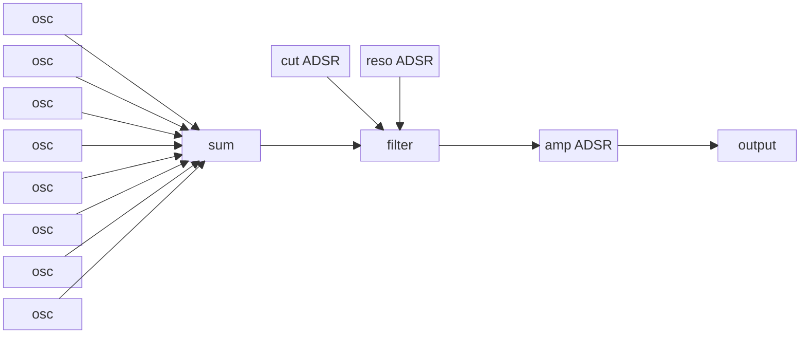

# subtractive synthesizer diagram

## description
[8 oscillators] -> sum -> filter -> amp adsr -> output

cut adsr -> filter
reso adsr -> filter

## diagram

```mermaid
---
config:
  block:
    padding: 16
  themeVariables:
    fontSize: 20px
---
block
  columns 9
  O1["osc"] space space:7
  O2["osc"] space space CUT["cut ADSR"] RESO["reso ADSR"] space:4
  O3["osc"] space space:7
  O4["osc"] space sum["sum"] space filter["filter"] space amp["amp ADSR"] space output["output"]
  O5["osc"] space space:7
  O6["osc"] space space:7
  O7["osc"] space space:7
  O8["osc"] space space:7

  O1 --> sum
  O2 --> sum
  O3 --> sum
  O4 --> sum
  O5 --> sum
  O6 --> sum
  O7 --> sum
  O8 --> sum

  sum --> filter
  filter --> amp
  amp --> output
  CUT --> filter
  RESO --> filter

```
