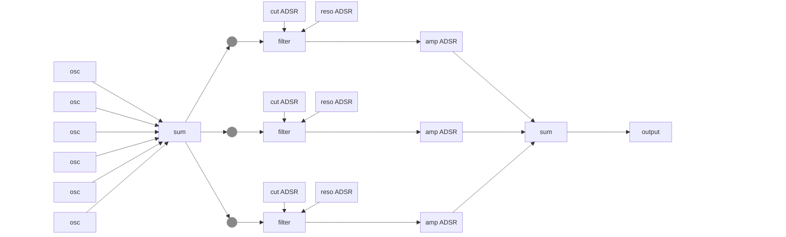

# cymbal synthesizer diagram

## description

[6 oscillators] -> sum -> [3 sections] -> output

each section:
cut adsr -> filter
reso adsr -> filter
filter adsr -> amplitude adsr

## diagram

```mermaid
---
config:
  block:
    padding: 32
  themeVariables:
    fontSize: 20px
---
block
  columns 15
  space:5 CUT1["cut ADSR"] RESO1["reso ADSR"] space:8
  space:4 N2((" ")) filter1["filter"] space:2 amp1["amp ADSR"] space:6
  space O1["osc"] space space:12
  space O2["osc"] space:3 CUT2["cut ADSR"] RESO2["reso ADSR"] space:8
  space O3["osc"] space sum["sum"] N5((" ")) filter2["filter"] space:2 amp2["amp ADSR"] space sum2["sum"] space output["output"] space:2
  space O4["osc"] space space:12
  space O5["osc"] space:3 CUT3["cut ADSR"] RESO3["reso ADSR"] space:8
  space O6["osc"] space:2 N8((" ")) filter3["filter"] space:2 amp3["amp ADSR"] space:6

  O1 --> sum
  O2 --> sum
  O3 --> sum
  O4 --> sum
  O5 --> sum
  O6 --> sum

  sum --> N2
  sum --> N5
  sum --> N8

  N2 --> filter1
  N5 --> filter2
  N8 --> filter3

  filter1 --> amp1
  filter2 --> amp2
  filter3 --> amp3

  amp1 --> sum2
  amp2 --> sum2
  amp3 --> sum2
  sum2 --> output

  CUT1 --> filter1
  RESO1 --> filter1
  CUT2 --> filter2
  RESO2 --> filter2
  CUT3 --> filter3
  RESO3 --> filter3

  style N2 fill:#888,stroke:#888
  style N5 fill:#888,stroke:#888
  style N8 fill:#888,stroke:#888
```
