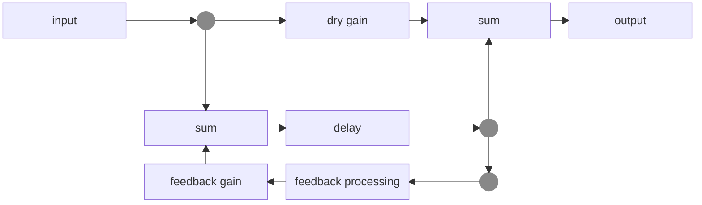

# echo diagram

## description

input -> dry gain -> output
input -> sum -> delay -> node -> feedback processing -> feedback gain -> node -> sum

## diagram

```mermaid
---
config:
  block:
    padding: 32
  themeVariables:
    fontSize: 20px
---
block
  columns 5
  IN["input"] N0((" ")) DRY["dry gain"] SUM2["sum"] OUT["output"]
  space:5
  space SUM["sum"] DELAY["delay"] N((" ")) space
  space FBG["feedback gain"] FB["feedback processing"] N3((" ")) space

  IN --> N0
  N0 --> DRY
  N0 --> SUM
  DRY --> SUM2
  SUM --> DELAY
  DELAY --> N
  N --> SUM2
  N --> N3
  N3 --> FB
  SUM2 --> OUT
  FB --> FBG
  FBG --> SUM

  style N fill:#888,stroke:#888
  style N0 fill:#888,stroke:#888
  style N3 fill:#888,stroke:#888
```
